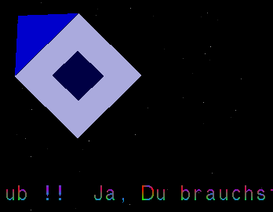

My [Assembly](https://en.wikipedia.org/wiki/Assembly_language) library for the [Amiga 500](https://en.wikipedia.org/wiki/Amiga_500) and its [Motorola 68000](https://en.wikipedia.org/wiki/Motorola_68000).

It has grown over the years and contains a collection of miscellaneous endeavours. Some highlights are listed below.

# API

A list of [APIs](https://en.wikipedia.org/wiki/API) for being called from [AmigaBASIC](https://de.wikipedia.org/wiki/AmigaBASIC). In general, the purpose is to significantly speed up basic programs. Access to the API is obtained via the entry point `LoadAssem`.

* Data transfer: `Move...`
* Decoder: `DrawIFF`
* Graphics: `Fade...`, `FillScreen`, `Scroll`, `ZoomOut`
* Library access: `DropMem`, `ForeScreen`, `Print...`, `ReserveMem`, `Lesen`, `Schreiben`
* Sorter: `Ranking`

# Commands

The binaries of these assembly programs can be put to the command folder `C` and executed from the shell.

* `LoadIFF`: Loads an displays an [IFF](https://en.wikipedia.org/wiki/Interchange_File_Format) image.
* `Nibble`: The source file and its destination as parameter and copies the file one data block at the time. Progress is indicated in small popover during the copy. This helps to partially copy files that are affected by read-errors.
* `PhoyhTracker`: Plays music for a [Tracker](https://en.wikipedia.org/wiki/Music_tracker) file on Amiga's four sound channels.
* `PrintC64Star10`: Prints an *IFF* image or markup text onto the [Star 10](https://www.c64-wiki.de/wiki/Star_NL-10) by tunneling the data stream through a [Commodore 64 (C64)](https://en.wikipedia.org/wiki/Commodore_64) gateway.
* `ScreenSaver*`: Series of screen savers. `ScreenSaverServer` loops through them.
	* `ScreenSaverEllipse`: Rotates the screen clockwise (or anti-clockwise for `ScreenSaverEllipse2`) by repeatedly altering the `system-configuration`.
	* `ScreenSaverMaus`: Mouse pointer shows morph animation from *I* to *A* to *Z*.
	* `ScreenSaverStars`: Based on program `Stars5` - when run from the command line, the text can be defined as parameter.
		* 
* `SequenceShorter`: Executes program according to the mouse position. This is useful when booting from the harddisk and wanting to directly open a program. The data schema used in the current version of this command corresponds to the matrix of `images/iff/SequenceShorterStartMenu`, which needs to be shown separately upfront - at best during the *startup-sequence* so that the user has some time to position the mouse. The execution targets are not part of this repository.

# Macros

Reusable program parts that go far into the direction of a higher level programming language, including data structures and new abstraction levels.

# Programs

Small standalone programs or demos. Larger [demos](https://en.wikipedia.org/wiki/Amiga_demos) that make extensive use of Amiga's [OCS](https://en.wikipedia.org/wiki/Amiga_Original_Chip_Set) are extracted into separate repositories (for example, see [here](https://github.com/phoyh/demo-rotating-globe3d) and [here](https://github.com/phoyh/demo-parallax-landscape)).

* `C64Loader` & `C64Saver`: Emulates C64's floppy drive [Commodore 1541](https://en.wikipedia.org/wiki/Commodore_1541). This enables C64's `LOAD"...",8` and `SAVE"...",8` commands to be run against the Amiga file system (and hopefully hard disk).
* `Clock`: Simulates elliptical clock with speedup *x700*.
	* 
* `Dungeon3d16colors`: [Texture mapping](https://en.wikipedia.org/wiki/Texture_mapping) of an IFF image on a 3d model of a wall - treated as a repeating tile. The [frame rate](https://en.wikipedia.org/wiki/Frame_rate) is only about *1* to *2* frames per second. If only one (instead of the four) [bitplanes](https://en.wikipedia.org/wiki/Bit_plane) were used, this would scale up to about *6* frames per second. Note how bad bitplanes are for pixel-based operations.
	*  
* `LigaSpieltag`: Draws random matches between eight [Bundesliga](https://en.wikipedia.org/wiki/Bundesliga) teams and rolls their result.
	* 
* `MillenniumTransfer`: Recreates the resource transfer GUI of [Millennium 2.2](https://en.wikipedia.org/wiki/Millennium_2.2).
	* 
* `RaumschiffeVersenken`: Lets you place your spaceships in this variant of the [Battleship](https://en.wikipedia.org/wiki/Battleship_(game)) game. The art is self-created and stored in `dc.b`s.
	* 
* `PicEmboss`: Extracts edges from arbitrary IFF and shows an [emboss](https://en.wikipedia.org/wiki/Image_embossing) version of the image. The sensitivity of edge recognition is controlled by the y-coordinate of the mouse. So move your mouse up or down to experiment with the effects.
	*  
* `ScrollMaster`: Arbitrary text is read from disk and scrolled in smoothly to left. Later versions include bouncing text (`v1.1+`) and a spaceship making its way to the right (`v1.2`).
	* <br>
* `Stars`: Five versions of flying through the stars.
	* `Stars`: The stars looking to the side - based on OS APIs.
	* `Stars2`: The same but this time directly on the hardware.
	* `Stars3`: The same looking straight.
	* `Stars4`: Adding [Dual Playfield](https://en.wikipedia.org/wiki/Amiga_Original_Chip_Set#Denise) mode containing text. This is also the version used for the screensaver `commands/ScreenSaverStars`.
	* `Stars5`: Adding vector graphics of a spaceship (or similar) instead of the text in the upper portion.
	* 
* `Text2dRevolving`: Turns text independently in both *y* and *z* axis. The period length of both axis is not a multiple of each other, leading to zoom-like effects. The lines connecting the letter polyline endpoints are drawn by the [Blitter](https://en.wikipedia.org/wiki/Amiga_Original_Chip_Set#Blitter) based on a mask.
	*  
* `WindowSlideDownUp`: Lets the current screen bounce down and up.
* `ZoomOutBitmap`: Displays bitmap and draws a minified version of it onto an arbitrary screen position.
	* 

# Proof-of-Concepts (POCs)

Initial tests on how to consume OS APIs (Intuition,...) or co-processor capabilities. In general, nothing useful comes out of the POC execution (except validating the consumption).

* `BlitterLineMaskEffect`: Draws a triangle based on masked lines using the [Blitter](https://en.wikipedia.org/wiki/Amiga_Original_Chip_Set#Blitter), resulting in a strange area pattern.
	* 

# How to Use
Put the repository into a mounted directory of an *emulated A500* and run the start script (assuming that [DevPac v2](https://archive.org/details/amiga-devpac-assembler-2.0) is installed in mounted `C`, and that your mounted directory is in `dh9`):
```
execute devpac214d
```

You can also start using the workbench (`info`-files provided).

Some programs are pre-assembled in `bin`. You can directly execute from there, too.
